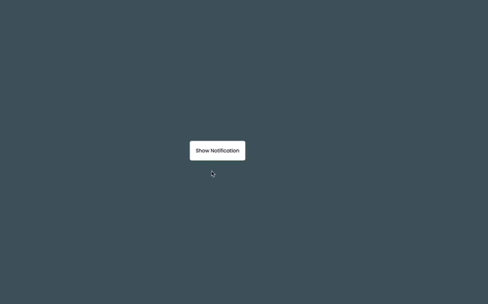

# Toast Notification

The Toast Notification Bar is a simple web component built with HTML, CSS, and JavaScript that allows you to generate random notifications on the right side of the window. These notifications can display different types of messages such as info, success, and failure messages & it disppears after 3 seconds. It provides a user-friendly way to display non-intrusive notifications to users when they interact with the "Show Notification" button.

## Demo

## How to Use

To use the Toast Notification Bar, follow these simple steps:

1. Download or clone the repository to your local machine.

2. Include the necessary files in your HTML document.

## Customization

You can customize the appearance of the Toast Notification Bar by modifying the CSS styles in the `style.css` file. Additionally, you can adjust the duration of how long the notifications appear on the screen before automatically dismissing by tweaking the `duration` property in the `script.js` file.

## Compatibility

The Toast Notification Bar should work on modern web browsers that support CSS animations and JavaScript.

Feel free to enhance the Toast Notification Bar with additional features or styles to better suit your project's needs. Enjoy using this lightweight and customizable notification solution! If you encounter any issues or have any questions, don't hesitate to reach out or open an issue on the repository. Happy coding!
